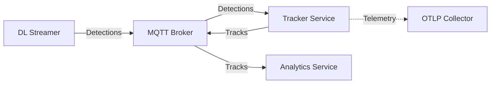
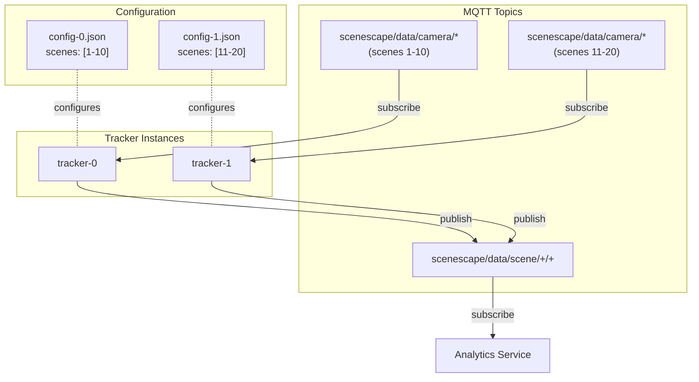
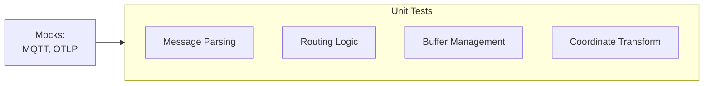
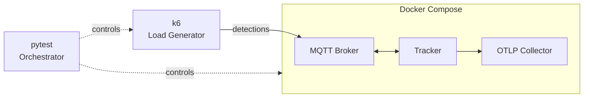

# Design Document: Tracker Service

- **Author(s)**: [Józef Daniecki](https://github.com/jdanieck)
- **Date**: 2026-01-16
- **Version**: 0.1
- **Status**: `Accepted`
- **Related ADRs**:
  - [ADR-0003: Scaling Controller Performance](../adr/0003-scaling-controller-performance.md)
  - [ADR-0007: Tracker Service](../adr/0007-tracker-service.md)
  - [ADR-0008: Tracker Service Horizontal Scaling](https://github.com/open-edge-platform/scenescape/pull/841)

---

## Overview

This document describes the high-level design, interfaces, and operational characteristics of the Tracker Service. For implementation details including threading model and data structures, see the [Implementation Guide](../../tracker/docs/implementation.md).

The Tracker Service transforms camera detections to world coordinates and applies Kalman filtering along with Hungarian association algorithm for persistent multi-object tracking. It addresses performance limitations in the existing Python-based tracking by using C++ with data-oriented design for true parallelism and SIMD optimization.

See [ADR-0007: Tracker Service](../adr/0007-tracker-service.md) for full rationale, alternatives considered, and architectural decisions.

---

## Goals

- Real-time tracking without frame drops meeting SLIs
- Horizontal scalability via static scene partitioning
- Observable and debuggable via standard telemetry

### SLIs

SLIs are measured under load: 4 cameras × 15 fps, up to 300 objects per message.

| SLI                  | Target     | Metric                                      | Description                               |
| -------------------- | ---------- | ------------------------------------------- | ----------------------------------------- |
| **Latency (p50)**    | < 30ms     | `scenescape_tracker_latency_seconds`        | Median processing time (50% headroom)     |
| **Latency (p99)**    | < 50ms     | `scenescape_tracker_latency_seconds`        | 99th percentile (25% headroom for jitter) |
| **Throughput**       | 60 msg/sec | `scenescape_tracker_messages_total`         | Sustained message rate                    |
| **Dropped Messages** | < 0.1%     | `scenescape_tracker_messages_dropped_total` | Ratio of dropped to total messages        |

## Non-Goals

Explicitly out of scope:

- **Kubernetes deployment** — Docker Compose only
- **Dynamic re-configuration** — Config changes require restart (by design for simplicity)
- **Object re-identification** — Track IDs reset on camera handoff (when non-overlapping) or long-term occlusion or object re-entry
- **Historical persistence** — Tracking state lost on service restart
- **NTP time correction** — No camera clock drift compensation
- **Lease-based scaling** — Static scene partitioning only
- **Multi-scene fusion** — No cross-scene track handoff
- **Scene hierarchy** — Flat scene structure only; no parent-child scene relationships or nested regions
- **Sensor tagging of a track** — No visibility array or per-sensor metadata on tracks

## Architecture



**DL Streamer** publishes detections (bounding boxes in camera coordinates) to MQTT. **Tracker Service** consumes detections, transforms them to world coordinates, applies Kalman filtering, and publishes tracks. **Analytics Service** consumes tracks for business logic (counting, dwell time, etc.). Telemetry flows to the OpenTelemetry Collector.

## Communication

### Input

**Topics Subscribed:**

| Topic                           | Description                                                                  |
| ------------------------------- | ---------------------------------------------------------------------------- |
| `scenescape/data/camera/+`      | Detection messages from AI pipeline with bounding boxes in pixel coordinates |
| `scenescape/cmd/scene/update/+` | Config change notifications from Manager API (dynamic mode only)             |

**Detection Message:**

See full schema: [`camera-data.schema.json`](../../tracker/schema/camera-data.schema.json)

```json
{
  "id": "atag-qcam1",
  "timestamp": "2026-01-20T10:05:01.482Z",
  "objects": {
    "person": [
      {
        "id": 1,
        "bounding_box_px": { "x": 4, "y": 0, "width": 127, "height": 309 }
      }
    ]
  }
}
```

### Output

**Topics Published:**

| Topic                                           | Description                                                               |
| ----------------------------------------------- | ------------------------------------------------------------------------- |
| `scenescape/data/scene/{scene_id}/{thing_type}` | Track messages with world coordinates, velocity, and persistent track IDs |

**Track Message:**

See full schema: [`scene-data.schema.json`](../../tracker/schema/scene-data.schema.json)

```json
{
  "id": "3bc091c7-e449-46a0-9540-29c499bca18c",
  "name": "Retail",
  "timestamp": "2026-01-20T10:05:01.590Z",
  "objects": [
    {
      "id": "8cce2bc7-51fc-4a6e-8c5d-a73ac72d3eb2",
      "category": "person",
      "translation": [-0.33, 2.48, 0.0],
      "velocity": [-0.04, 0.2, 0.0],
      "size": [0.5, 0.5, 1.85],
      "rotation": [0, 0, 0, 1]
    }
  ]
}
```

## Data

In-memory only - no persistent storage. Stateless design for horizontal scalability.

| Data                           | Retention                                   |
| ------------------------------ | ------------------------------------------- |
| Tracking state (Kalman filter) | While running; lost on restart              |
| Detection buffers              | Flushed `time_chunking_rate_fps` per second |
| Publish queue                  | Drained on shutdown (2s timeout)            |
| Scene configuration            | Loaded at startup                           |

## Operations

### Health Checks

HTTP server on configurable port (default 8080):

- `/healthz` — Liveness probe (process alive?)
- `/readyz` — Readiness probe (MQTT connected and subscribed?)

Built-in `healthcheck` subcommand for distroless containers (no shell/curl):

```yaml
healthcheck:
  test: ["CMD", "/scenescape/tracker", "healthcheck"]
  interval: 1s
  timeout: 1s
  retries: 3
  start_period: 2s
```

### Configuration

Service and scene configuration loaded at startup. See [`config.schema.json`](../../tracker/schema/config.schema.json) for complete schema.

Configuration changes require service restart. This simplifies implementation (no partial state migration) and tracking state re-establishes within seconds.

**Environment Variable Overrides:** Configuration values can be overridden via `TRACKER_*` environment variables. Environment variables take precedence over config file values, enabling deployment-specific overrides.

#### Static Mode

Scenes defined inline in config file:

- Set `scenes.source: "inline"` and provide `scenes.data` array
- Self-contained deployment with no external dependencies
- Enables horizontal scaling via static scene partitioning (see [Horizontal Scaling](#horizontal-scaling))
- Suitable for development and production deployments with pre-defined scene assignments

#### Dynamic Mode

Scenes fetched from Manager API at startup:

- Set `scenes.source: "api"` or omit `scenes` section (defaults to API mode)
- Requires `infrastructure.manager` with API URL and credentials
- Subscribes to `scenescape/cmd/scene/update/{scene_id}` for change notifications
- On notification: logs change, exits gracefully (Docker restarts the service which loads new config at startup)
- Suitable for multi-node deployments with centralized scene management

### Observability

All telemetry is exported via OTLP/HTTP to the OpenTelemetry Collector. Metrics, traces, and logs are correlated:

- **`trace_id`** — Links logs and spans across DL Streamer → Tracker → Analytics for a single detection flow
- **`span_id`** — Links logs to the specific span within that trace
- **Exemplars** — Metrics include `trace_id` exemplars, linking latency spikes to specific traces

This correlation enables jumping from a latency spike in metrics → trace → logs in observability backends (e.g., Grafana).

#### Metrics

| Metric                                      | Type      | Labels                  | Description                      |
| ------------------------------------------- | --------- | ----------------------- | -------------------------------- |
| `scenescape_tracker_latency_seconds`        | histogram | scene, category         | Processing latency (p50/p95/p99) |
| `scenescape_tracker_messages_total`         | counter   | scene, category         | Messages processed               |
| `scenescape_tracker_messages_dropped_total` | counter   | scene, category, reason | Messages dropped                 |
| `scenescape_tracker_tracks_active`          | gauge     | scene, category         | Currently active tracks          |

#### Distributed Tracing

| Span                   | Parent            | Attributes          | Description                       |
| ---------------------- | ----------------- | ------------------- | --------------------------------- |
| `tracker.process`      | DL Streamer span  | scene_id, camera_id | End-to-end detection processing   |
| `tracker.mqtt_handler` | `tracker.process` | topic, message_id   | MQTT message receive and parse    |
| `tracker.tracking`     | `tracker.process` | object_count        | Kalman filter tracking processing |
| `tracker.publish`      | `tracker.process` | topic, track_count  | MQTT track publish                |

```mermaid
gantt
    title Trace Span Timeline
    dateFormat ss
    axisFormat %S

    section DL Streamer
    dlstreamer.detect       :a1, 00, 3s

    section MQTT Broker
    broker transfer         :a2, after a1, 1s

    section Tracker
    tracker.process         :a3, after a2, 6s
    tracker.mqtt_handler    :a4, after a2, 1s
    tracker.tracking        :a5, after a4, 4s
    tracker.publish         :a6, after a5, 1s
```



Trace context follows W3C Trace Context: extract `traceparent` from inbound MQTT, propagate to outbound messages.

#### Structured Logging

JSON format defined by [`log.schema.json`](../../tracker/schema/log.schema.json):

```json
{
  "timestamp": "2025-07-15T14:32:01.847Z",
  "level": "info",
  "msg": "tracks published",
  "trace_id": "0af7651916cd43dd8448eb211c80319c",
  "span_id": "b7ad6b7169203331"
}
```

The `trace_id` and `span_id` fields enable log correlation across DL Streamer → Tracker → Analytics in observability backends.

## Security

### Input Validation

All inputs are validated against JSON schemas with unknown fields explicitly allowed (`additionalProperties: true`):

| Input              | Schema                    | On Failure                |
| ------------------ | ------------------------- | ------------------------- |
| Service config     | `config.schema.json`      | Fail-fast at startup      |
| Scene topology     | `scene.schema.json`       | Fail-fast at startup      |
| Detection messages | `camera-data.schema.json` | Log warning, drop message |

Unknown fields allowed for forward compatibility - older services ignore new fields from newer producers.

### Transport Security

All MQTT connections require mTLS (mutual TLS):

- **Server verification** — Validates broker certificate against CA
- **Client authentication** — Presents client certificate to broker
- **No plaintext** — TLS required; unencrypted connections rejected

### Secrets Management

Secrets (certificates, API credentials) are injected via Docker or Kubernetes secrets — never stored in configuration files. The configuration references file paths only (e.g., `/run/secrets/client-cert`).

### Container Hardening

The container has a minimal attack surface: non-root user, distroless base image, read-only filesystem, all capabilities dropped, and `no-new-privileges` enabled.

## Deployment

### Docker Compose

Docker Compose is the primary deployment method for development and production. Per-instance configurations are managed via Docker Compose config files.

**Resources:**

- CPU requirements scale with object count and number of scenes
- Memory dominated by detection buffers and tracking state
- Storage: Ephemeral only (no persistent volumes)

### Kubernetes

Kubernetes deployment is planned for a future release. The implementation will use StatefulSet with ConfigMap per instance.

### Horizontal Scaling

#### Static Scene Partitioning

Each instance handles a fixed set of scenes configured at startup via config file. No coordination between instances — each subscribes only to its assigned scene topics.



Add/remove instances by deploying with new config files specifying scene assignments.

#### Dynamic Scaling (Proposed)

Lease-based dynamic scaling for automatic scene distribution and failover is under consideration. See [ADR-0008: Tracker Service Horizontal Scaling](https://github.com/open-edge-platform/scenescape/pull/841) for details.

## Testing

### Unit Tests

Unit tests are GoogleTest-based, fast, and deterministic with mocked dependencies.



- Test message parsing, routing, buffering, coordinate transformation
- Run in CI on every commit

### Service Tests

Service tests use pytest, Docker Compose, and k6 for full-stack validation. Tests are isolated at the process level — real binaries, real MQTT broker, no mocks.



- Validate normal operation, broker outage recovery, backpressure handling, graceful shutdown
- Multi-instance testing for scene partitioning validation
- Doubles as load testing when configured with realistic message rates and object counts
- Run in CI on every commit

### End-to-End Tests

End-to-end tests are validated manually for this release. Automation is planned for the next release — it will validate the full pipeline from DL Streamer through Tracker to Analytics with real video streams.
