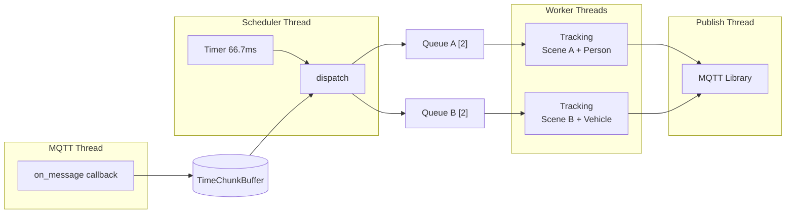
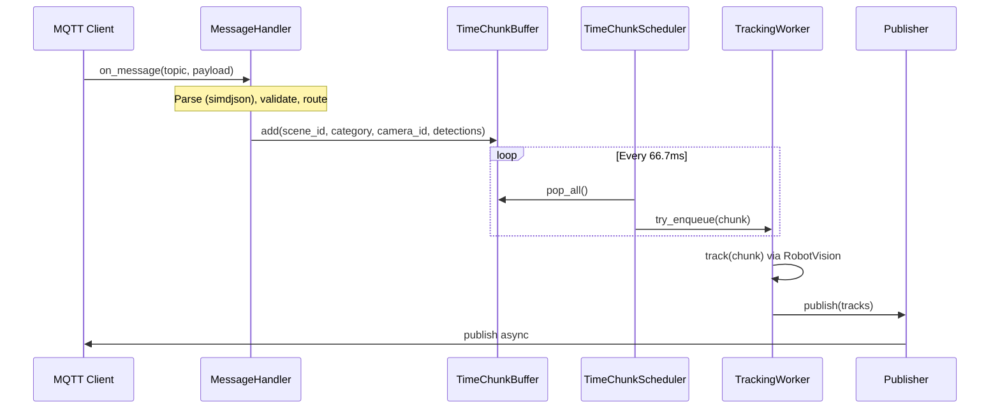
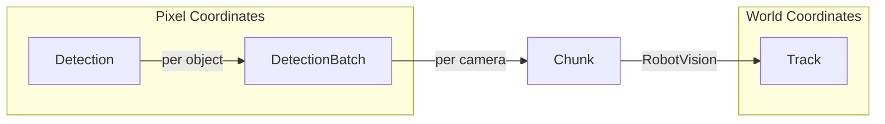
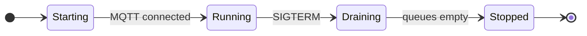

# Tracker Service Implementation Guide

## Overview

This document focuses on the most challenging implementation concepts in the Tracker Service — threading model, synchronization patterns, and data flow. It is not intended to be a complete reference. Consult the [source code](../src/) for full implementation details.

For high-level design, goals, SLIs, and observability details, see [Design Document](../../docs/design/tracker-service.md). For message and configuration schemas, see [`tracker/schema/`](../schema/).

---

## Time-Chunk Processing Pipeline

The tracker aggregates detections into fixed time intervals (chunks) before processing. This enables multi-camera fusion, improves tracker efficiency, and decouples camera FPS from output rate.

### Chunk Timing

```
Camera A:    |--D1--|--D2--|--D3--|--D4--|--D5--|
Camera B:      |--D1--|--D2--|--D3--|--D4--|
Chunk:       [=======CHUNK 0=======][=======CHUNK 1=======]
             0ms                   66.7ms                 133.3ms
```

- **Default interval**: 66.7ms (15 FPS, configurable via `time_chunking_rate_fps`)
- **Timer**: `std::condition_variable::wait_for()` with `steady_clock` (~1-10ms jitter, acceptable for 15 FPS)

### Threading Model



- **MQTT thread**: Parses messages, adds to buffer (producer)
- **Scheduler thread**: Single timer loop, dispatches to all scopes each interval
- **Worker threads**: One per `TrackingScope` (scene+category), owns RobotVision instance, processes independently
- **Publish thread**: MQTT library background thread, handles async network I/O for outgoing messages

### Time Chunk Buffer Structure

Per-scope (scene+category), per-camera buffer with **keep-latest** semantics:

```cpp
// Composite key for worker routing. Each scope gets its own tracker instance.
struct TrackingScope {
    std::string scene_id;
    std::string category;
    auto operator==(const TrackingScope&) const -> bool = default;
};

// Hash specialization (XOR-shift combine)
template <>
struct std::hash<TrackingScope> {
    auto operator()(const TrackingScope& s) const noexcept -> std::size_t {
        const auto h1 = std::hash<std::string>{}(s.scene_id);
        const auto h2 = std::hash<std::string>{}(s.category);
        return h1 ^ (h2 * 0x9e3779b97f4a7c15ULL + (h1 << 6) + (h1 >> 2));
    }
};

using CameraMap = std::unordered_map<std::string, DetectionBatch>;   // camera_id → batch
using BufferMap = std::unordered_map<TrackingScope, CameraMap>;      // scope → cameras

struct TimeChunkBuffer {
    BufferMap buffer_;
    std::mutex mutex_;

    void add(const std::string& scene_id, const std::string& category,
             const std::string& camera_id, DetectionBatch&& detections);
    auto pop_all() -> BufferMap;  // Atomic swap, clears buffer
};
```

### Scheduler Loop

```cpp
void TimeChunkScheduler::run() {
    while (!stop_requested_) {
        wait_for_interval();  // 66.7ms default

        BufferMap snapshot = buffer_.pop_all();
        for (auto& [scope, cameras] : snapshot) {
            dispatch(scope, std::move(cameras));
        }
    }
}

void TimeChunkScheduler::dispatch(const TrackingScope& scope, CameraMap&& cameras) {
    if (!workers_.contains(scope)) create_worker(scope);

    // Convert map to sorted vector for deterministic ordering
    std::vector<DetectionBatch> batches;
    for (auto& [camera_id, batch] : cameras) {
        batches.push_back(std::move(batch));
    }
    std::sort(batches.begin(), batches.end(),
        [](auto& a, auto& b) { return a.timestamp < b.timestamp; });

    Chunk chunk{scope.scene_id, scope.category, steady_clock::now(), std::move(batches)};
    if (!queues_[scope].try_enqueue(std::move(chunk))) {
        metrics_.increment_dropped(scope.scene_id, scope.category, "tracker_busy");
    }
}
```

Workers are created lazily on first detection per scene+category. Each owns a dedicated thread and RobotVision instance.

---

## Message Flow



### Memory Management

Allocations occur at format boundaries (JSON parse, RobotVision conversion, JSON serialize). Between stages, move semantics transfer heap pointers without copying detection data.

| Stage                      | Allocations                               |
| -------------------------- | ----------------------------------------- |
| Parse JSON → Detection     | Create Detection objects (unavoidable)    |
| Buffer → Scheduler → Queue | None (pointer swap via `std::move`)       |
| Detection → TrackedObject  | Create TrackedObject (RobotVision format) |
| TrackedObject → Track      | Create Track objects (output format)      |
| Track → JSON               | Serialize output string                   |

**Optimization**: Use `reserve()` to avoid reallocations during parsing and conversion:

```cpp
// simdjson provides array count before iteration
auto objects_array = doc["objects"][category].get_array();
detections.reserve(objects_array.count_elements());

rv_objects.reserve(chunk.total_detections());
```

Object pools are a future optimization if profiling shows allocation as a bottleneck.

---

## Error Handling

All errors increment `scenescape_tracker_messages_dropped_total{scene, category, reason}`.

| Scenario                       | Action                                |
| ------------------------------ | ------------------------------------- |
| Lag > `max_lag_s` (default 1s) | Drop with `reason="fell_behind"`      |
| Malformed JSON                 | Drop with `reason="parse_error"`      |
| Schema validation fail         | Drop with `reason="validation_error"` |
| Queue full (backpressure)      | Drop with `reason="tracker_busy"`     |
| Unknown camera                 | Drop with `reason="unknown_camera"`   |
| Out-of-order in chunk          | Sort by timestamp before tracking     |
| No detections in chunk         | Skip dispatch; Kalman filter predicts |

### Backpressure Strategy

Bounded queue (capacity=2) per scene+category. Drop **current** chunk if full - preserve in-flight work:

```cpp
if (!queue.try_enqueue(std::move(chunk))) {
    metrics_.increment_dropped(scene_id, category, "tracker_busy");
    return;  // Drop this chunk
}
```

Per-scene+category isolation ensures overload in one doesn't affect others.

---

## Core Data Structures



### Detection (Input)

A single detected object from inference, in pixel coordinates. See [`camera-data.schema.json`](../schema/camera-data.schema.json) for the input message schema.

```cpp
struct BoundingBoxPx { double x, y, width, height; };

struct Detection {
    std::optional<int64_t> id;  // Frame-local detection ID (optional)
    BoundingBoxPx bounding_box_px;
};
```

### DetectionBatch

All detections from a single camera frame. This is the unit stored in `TimeChunkBuffer`.

```cpp
struct DetectionBatch {
    std::string camera_id;
    std::chrono::steady_clock::time_point timestamp;
    std::vector<Detection> detections;
    ObservabilityContext obs_ctx;
};
```

### Chunk

Aggregated batches from multiple cameras within one time interval (66.7ms). Dispatched to `TrackingWorker` for tracking.

```cpp
struct Chunk {
    std::string scene_id;
    std::string category;
    std::chrono::steady_clock::time_point chunk_time;
    std::vector<DetectionBatch> camera_batches;  // Sorted by timestamp

    bool is_sentinel() const { return scene_id.empty(); }
};
```

### Track (Output)

RobotVision output in world coordinates. See [`scene-data.schema.json`](../schema/scene-data.schema.json) for the output message schema.

```cpp
struct Track {
    std::string id;             // Persistent track ID (UUID)
    std::string category;       // Object category (e.g., person, vehicle)
    std::array<double, 3> translation;  // World position [x, y, z] meters
    std::array<double, 3> velocity;     // Velocity [vx, vy, vz] m/s
    std::array<double, 3> size;         // Object size [length, width, height] meters
    std::array<double, 4> rotation;     // Orientation quaternion [x, y, z, w]
};
```

### ObservabilityContext

Carries trace context, span lifecycle, and stage timestamps through the pipeline. Each `DetectionBatch` owns its `ObservabilityContext`, enabling per-camera-batch trace correlation and latency breakdown. See [Design Document](../../docs/design/tracker-service.md#observability) for metrics, tracing, and logging specifications.

```cpp
struct ObservabilityContext {
    // W3C Trace Context (extracted from MQTT user properties)
    std::array<uint8_t, 16> trace_id;
    std::array<uint8_t, 8> span_id;
    std::string tracestate;

    // OTel span lifecycle
    otel::trace::Span process_span;        // Parent: tracker.process (child of upstream)
    otel::trace::Span current_stage_span;  // Active child span for current stage
    std::string current_stage;             // Stage name for drop metrics

    // Stage timestamps for latency calculation
    std::chrono::steady_clock::time_point receive_time;
    std::chrono::steady_clock::time_point parse_time;
    std::chrono::steady_clock::time_point buffer_time;
    std::chrono::steady_clock::time_point dispatch_time;
    std::chrono::steady_clock::time_point track_time;
    std::chrono::steady_clock::time_point publish_time;

    // Trace context propagation
    auto to_traceparent() const -> std::string;
    static auto from_mqtt_properties(const mqtt::properties& props, Tracer& tracer)
        -> ObservabilityContext;

    // Stage transitions (end current child span, start new child span, record timestamp)
    void begin_tracking(Tracer& tracer);
    void begin_publish(Tracer& tracer);

    // Single-point emission for all telemetry (metrics, traces, logs)
    void finalize(Meter& meter, Logger& logger);  // Success: ends spans OK, records latency histogram
    void abort(std::string_view reason, Meter& meter, Logger& logger);  // Drop: ends spans with error, records drop metrics
};
```

**Unified Emission Pattern**: Context is recorded at each pipeline stage; telemetry is emitted only at pipeline end. Call `finalize()` after successful publish or `abort(reason)` when dropping a message. Both methods:

1. End all open spans (with OK or Error status)
2. Record latency histogram with exemplar linking to trace
3. Emit structured log with `trace_id`, `span_id`, and latency/error details

This ensures metrics, traces, and logs are correlated and emitted from a single code path, avoiding scattered instrumentation throughout the pipeline.

### RobotVision Types

RobotVision is the external multi-object tracking library that provides Kalman filtering, track association, and world-coordinate projection. The following types from `rv::tracking` namespace define the interface between the Tracker Service and RobotVision.

```cpp
namespace rv {

struct CameraParams {
    const cv::Mat& intrinsics;
    const cv::Mat& distortion;
};

// Convert pixel bounding box to undistorted world coordinates
cv::Rect2f computePixelsToMeterPlane(const cv::Rect2f& bbox, const CameraParams& params);

namespace tracking {

struct TrackedObject {
    Id id;                      // Track ID assigned by RobotVision
    double x, y, z;             // Position (meters)
    double vx, vy;              // Velocity (m/s)
    double length, width, height;  // Size (meters)
    double yaw;                 // Orientation (radians)
    Classification classification;
    std::unordered_map<std::string, std::string> attributes;
};

class MultipleObjectTracker {
    void track(std::vector<std::vector<TrackedObject>> objects_per_camera,
               time_point timestamp, DistanceType type, double threshold);
    auto getReliableTracks() -> std::vector<TrackedObject>;
};

}  // namespace tracking
}  // namespace rv
```

---

## Synchronization

**Thread Boundaries:**

| Component         | Producer → Consumer | Notes                                               |
| ----------------- | ------------------- | --------------------------------------------------- |
| `TimeChunkBuffer` | MQTT → Scheduler    | Protected by `mutex_`; atomic swap on `pop_all()`   |
| Per-scope queues  | Scheduler → Worker  | SPSC pattern; bounded capacity (2) for backpressure |

**Key Pattern:** Minimal lock scope with atomic swap:

```cpp
auto TimeChunkBuffer::pop_all() -> BufferSnapshot {
    std::lock_guard lock(mutex_);
    auto snapshot = std::move(buffer_);
    buffer_.clear();
    return snapshot;
}
```

**Shutdown Signaling:** Atomic flag with condition variable notification:

```cpp
std::atomic<bool> stop_requested_{false};
void request_stop() {
    stop_requested_.store(true, std::memory_order_release);
    cv_.notify_all();
}
```

---

## Lifecycle



**Startup**: Load configuration → initialize telemetry → start scheduler thread → connect to MQTT broker.

**Shutdown**: Stop accepting new messages → drain queues (2s timeout) → send sentinel chunks to workers → flush telemetry → disconnect from MQTT.

**Reconnection**: The MQTT client reconnects with exponential backoff while the scheduler continues processing buffered data. OpenTelemetry export is best-effort; the service continues operating if the collector is unavailable.

See [Design Document](../../docs/design/tracker-service.md#operations) for health checks and configuration details.
